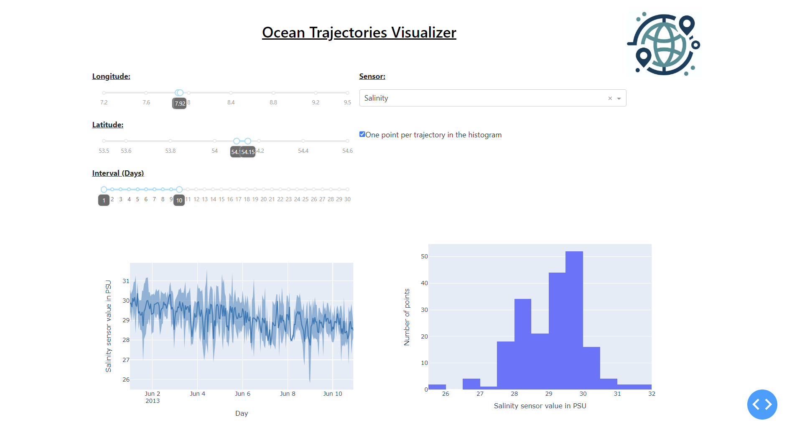
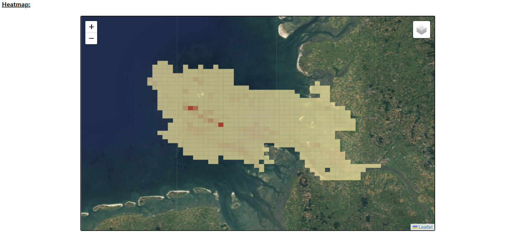
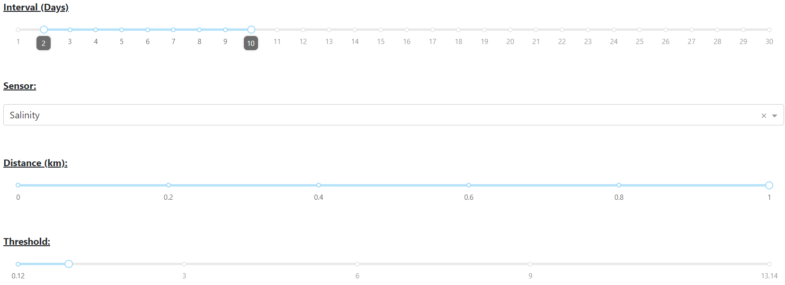
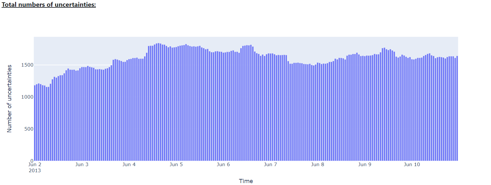

# <ins>Sea Trajectories Visualizer</ins>

#### <ins>General Information:</ins>

#### <ins>General Information:</ins>

#### <ins>General Information:</ins>

#### <ins>Example:</ins>

<figure>
  
  <figcaption><strong>Figure 1:</strong> Main page of the application.</figcaption>
</figure>
 
<figure>
  
  <figcaption><strong>Figure 2:</strong> Heatmap.</figcaption>
</figure>
 
<figure>
  
  <figcaption><strong>Figure 3:</strong> Heatmap configuration.</figcaption>
</figure>
 
<figure>
  
  <figcaption><strong>Figure 4:</strong> Total number of uncertainties.</figcaption>
</figure>
